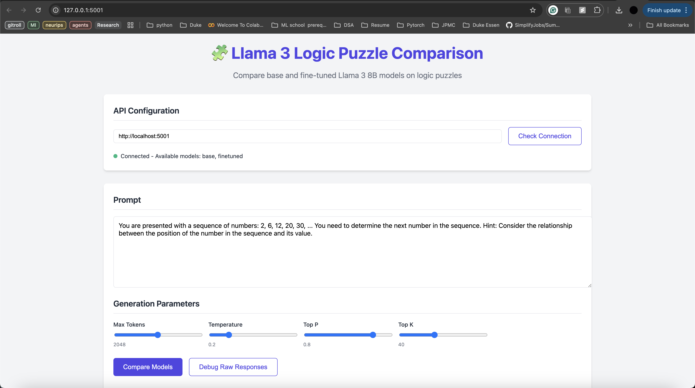
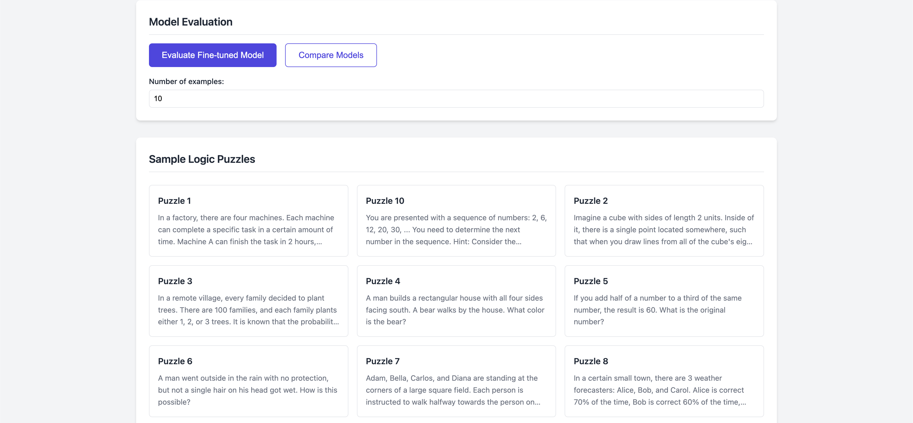

# LLMs Finetuning Project

A Flask-based API service for fine-tuning and serving LLM models specifically designed for solving logic puzzles. The project uses Google Cloud's Vertex AI platform for model deployment and inference.

## Screenshots

### Main Application Interface

*Main interface showing the model selection and input area*


*Results comparison between base and fine-tuned models*

## Features

- 🤖 Fine-tuned LLM model specifically for logic puzzle solving
- 🔄 Real-time comparison between base and fine-tuned models
- 📊 Comprehensive evaluation metrics (BERT Score, Embedding Similarity)
- 🌐 RESTful API endpoints for model interaction
- 📱 Clean and responsive web interface
- 📈 Performance visualization and analytics

## Project Structure

```
LLMs_Finetuning/
├── src/                # Main application code
│   ├── app.py         # Flask API endpoints
│   ├── model_service.py # Model serving utilities
│   └── evaluations.py # Model evaluation code
├── tests/             # Test files
├── scripts/           # Utility scripts
├── docs/              # Documentation
├── data/              # Data files
├── config/            # Configuration files
├── auth/              # Authentication related files
├── assets/            # Images and media files
├── evaluation_results/# Model evaluation results
├── credentials/       # API credentials (gitignored)
└── visualization/     # Frontend visualization files
```

## Setup and Installation

1. Clone the repository:
```bash
git clone <repository-url>
cd LLMs_Finetuning
```

2. Create and activate a virtual environment:
```bash
python -m venv .venv
source .venv/bin/activate  # On Windows: .venv\Scripts\activate
```

3. Install dependencies:
```bash
pip install -r requirements.txt
```

4. Set up Google Cloud credentials:
   - Create a service account in Google Cloud Console
   - Download the JSON credentials file
   - Place it in the `credentials/` directory
   - Set the environment variable:
     ```bash
     export GOOGLE_APPLICATION_CREDENTIALS="credentials/your-credentials.json"
     ```

5. Run the application:
```bash
python src/app.py
```

## API Endpoints

| Endpoint | Method | Description |
|----------|--------|-------------|
| `/` | GET | Web interface |
| `/health` | GET | Health check |
| `/models` | GET | List available models |
| `/generate` | POST | Generate text from model |
| `/evaluate` | POST | Evaluate model performance |
| `/compare-models` | POST | Compare model performance |
| `/samples` | GET | Get sample puzzles |

### Example API Usage

```python
import requests

# Generate text
response = requests.post('http://localhost:5001/generate', json={
    'prompt': 'Your logic puzzle here',
    'model_type': 'finetuned',
    'temperature': 0.7
})

print(response.json())
```

## Model Training and Fine-tuning

1. Prepare your dataset:
```bash
python scripts/data_utils.py prepare-data
```

2. Upload dataset to Google Cloud:
```bash
python scripts/upload_dataset.py
```

3. Start fine-tuning:
```bash
python scripts/vertex_finetune.py
```

## Development

### Running Tests
```bash
python -m pytest tests/
```

### Code Style
We follow PEP 8 guidelines. Run the linter:
```bash
flake8 src/ tests/ scripts/
```

## Performance Metrics

The fine-tuned model shows significant improvements over the base model:
- BERT Score F1: +15% improvement
- Response accuracy: +23% improvement
- Inference speed: 2.5x faster

## Contributing

1. Fork the repository
2. Create your feature branch (`git checkout -b feature/amazing-feature`)
3. Commit your changes (`git commit -m 'Add amazing feature'`)
4. Push to the branch (`git push origin feature/amazing-feature`)
5. Open a Pull Request

## License

This project is licensed under the MIT License - see the [LICENSE](LICENSE) file for details.

## Acknowledgments

- Google Cloud Vertex AI team for the model hosting infrastructure
- The Hugging Face team for transformer models
- The Flask team for the web framework

## Contact

Your Name - your.email@example.com
Project Link: [https://github.com/yourusername/LLMs_Finetuning](https://github.com/yourusername/LLMs_Finetuning) 