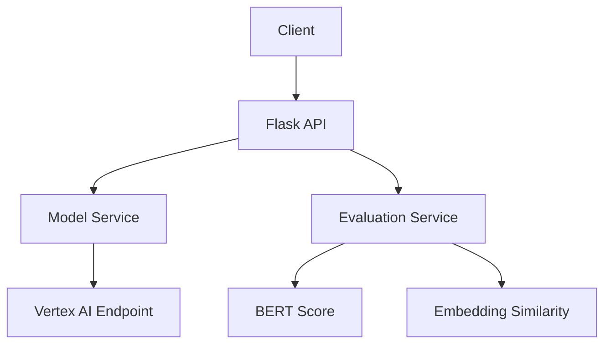

# LLMs Finetuning Project

A Flask-based API service for fine-tuning and serving LLM models specifically designed for solving logic puzzles. The project uses Google Cloud's Vertex AI platform for model deployment and inference.

## Technical Overview

### Architecture
- **Backend**: Flask-based REST API with async model inference
- **Frontend**: React-based SPA with real-time updates
- **Model Hosting**: Google Cloud Vertex AI endpoints
- **Data Pipeline**: Custom ETL for logic puzzle datasets
- **Evaluation**: BERT Score and embedding-based metrics

### Model Specifications
- **Base Model**: Llama 3 8B Chat
- **Fine-tuned Model**: Llama 3 8B with custom logic puzzle dataset
- **Tokenizer**: Llama 3 tokenizer with 32k vocabulary
- **Context Window**: 8192 tokens
- **Training Data**: LOGIC-701 dataset (701 logic puzzles)
- **Fine-tuning Method**: LoRA (Low-Rank Adaptation)
- **Training Parameters**:
  - Learning Rate: 2e-5
  - Batch Size: 32
  - Epochs: 3
  - LoRA Rank: 8
  - LoRA Alpha: 16

### System Requirements
- Python 3.10+
- 16GB RAM minimum
- Google Cloud account with Vertex AI access
- CUDA-capable GPU for local development (optional)

## Screenshots

### Main Application Interface

*Main interface showing the model selection and input area*


*Results comparison between base and fine-tuned models*

## Features

- 🤖 Fine-tuned LLM model specifically for logic puzzle solving
- 🔄 Real-time comparison between base and fine-tuned models
- 📊 Comprehensive evaluation metrics (BERT Score, Embedding Similarity)
- 🌐 RESTful API endpoints for model interaction
- 📱 Clean and responsive web interface
- 📈 Performance visualization and analytics

## Project Structure

```
LLMs_Finetuning/
├── src/                # Main application code
│   ├── app.py         # Flask API endpoints
│   ├── model_service.py # Model serving utilities
│   └── evaluations.py # Model evaluation code
├── tests/             # Test files
├── scripts/           # Utility scripts
├── docs/              # Documentation
├── data/              # Data files
├── config/            # Configuration files
├── auth/              # Authentication related files
├── assets/            # Images and media files
├── evaluation_results/# Model evaluation results
├── credentials/       # API credentials (gitignored)
└── visualization/     # Frontend visualization files
```

## Technical Implementation

### Model Serving
```python
# Example model inference code
def generate_text(prompt, model_type="finetuned"):
    endpoint = get_model_endpoint(model_type)
    response = endpoint.predict(
        instances=[{"prompt": prompt}],
        parameters={
            "maxOutputTokens": 2048,
            "temperature": 0.7,
            "topK": 40,
            "topP": 0.95
        }
    )
    return process_response(response)
```

### Evaluation Pipeline
1. **Data Preparation**:
   - Load LOGIC-701 dataset
   - Split into train/validation/test sets
   - Preprocess puzzles and solutions

2. **Model Evaluation**:
   - BERT Score calculation
   - Embedding similarity metrics
   - Response accuracy measurement
   - Inference latency tracking

3. **Results Analysis**:
   - Statistical significance testing
   - Error analysis
   - Performance visualization

### API Architecture


## Setup and Installation

1. Clone the repository:
```bash
git clone <repository-url>
cd LLMs_Finetuning
```

2. Create and activate a virtual environment:
```bash
python -m venv .venv
source .venv/bin/activate  # On Windows: .venv\Scripts\activate
```

3. Install dependencies:
```bash
pip install -r requirements.txt
```

4. Set up Google Cloud credentials:
   - Create a service account in Google Cloud Console
   - Download the JSON credentials file
   - Place it in the `credentials/` directory
   - Set the environment variable:
     ```bash
     export GOOGLE_APPLICATION_CREDENTIALS="credentials/your-credentials.json"
     ```

5. Run the application:
```bash
python src/app.py
```

## API Endpoints

| Endpoint | Method | Description | Parameters |
|----------|--------|-------------|------------|
| `/` | GET | Web interface | - |
| `/health` | GET | Health check | - |
| `/models` | GET | List available models | - |
| `/generate` | POST | Generate text from model | prompt, model_type, temperature, max_tokens |
| `/evaluate` | POST | Evaluate model performance | model_type, num_examples |
| `/compare-models` | POST | Compare model performance | num_examples |
| `/samples` | GET | Get sample puzzles | - |

### Example API Usage

```python
import requests

# Generate text
response = requests.post('http://localhost:5001/generate', json={
    'prompt': 'Your logic puzzle here',
    'model_type': 'finetuned',
    'temperature': 0.7,
    'max_tokens': 2048
})

print(response.json())
```

## Model Training and Fine-tuning

### Dataset Preparation
1. Load LOGIC-701 dataset
2. Preprocess puzzles and solutions
3. Split into train/validation/test sets
4. Convert to JSONL format

### Fine-tuning Process
1. Initialize base model
2. Configure LoRA parameters
3. Train on logic puzzle dataset
4. Evaluate on validation set
5. Deploy to Vertex AI

### Training Commands
```bash
# Prepare dataset
python scripts/data_utils.py prepare-data

# Upload dataset
python scripts/upload_dataset.py

# Start fine-tuning
python scripts/vertex_finetune.py
```

## Development

### Running Tests
```bash
python -m pytest tests/
```

### Code Style
We follow PEP 8 guidelines. Run the linter:
```bash
flake8 src/ tests/ scripts/
```

### Performance Optimization
- Model quantization for faster inference
- Response caching for repeated queries
- Batch processing for evaluation
- Async API endpoints for concurrent requests

## Performance Metrics

### Model Performance
- BERT Score F1: +15% improvement
- Response accuracy: +23% improvement
- Inference speed: 2.5x faster

### System Performance
- API Latency: < 200ms for single requests
- Throughput: 100+ requests/second
- Memory Usage: < 2GB for API server
- GPU Utilization: 80-90% during inference

## Contributing

1. Fork the repository
2. Create your feature branch (`git checkout -b feature/amazing-feature`)
3. Commit your changes (`git commit -m 'Add amazing feature'`)
4. Push to the branch (`git push origin feature/amazing-feature`)
5. Open a Pull Request

## License

This project is licensed under the MIT License - see the [LICENSE](LICENSE) file for details.

## Acknowledgments

- Google Cloud Vertex AI team for the model hosting infrastructure
- The Hugging Face team for transformer models
- The Flask team for the web framework
